# 小学数学题求解实验 Presentation

> 模型：Qwen2.5-0.5B-Instruct。主线：LoRA SFT 起步，修数据和验证集，接入 CoT，再用多源投票和 DPO 做最后补强。最终提交文件为 `cot4-clean007008010-dpo66-vote.csv`，DataFountain 分数为 `0.252375`。

> **郑智君 23307130062** **可怜显卡队**

## 0. 主线

这次实验的任务很直接：给模型一道小学数学题，让它输出最后答案。难点也很直接：小学数学题不只是四则运算，里面有分数、小数、百分数、单位换算、几何、多步应用题。模型一旦把中间数字当成答案，或者把 `0.5`、`1/2`、`50%` 这类格式混在一起，最后提交就会错。

所以我没有只做一次训练，而是按一个闭环推进：先跑 baseline，发现本地验证有问题；然后清洗数据、重建无泄漏验证集；再从 direct answer 转到 CoT；最后把多个 checkpoint 和不同数据版本的模型结果做投票。DPO 是最后一轮尝试，它让单模型略有提升，但放进投票后本地没有继续涨，说明 preference 数据还要更细。

<div style="display:flex; gap:10px; align-items:flex-start;">
  <figure style="width:49%; margin:0;">
    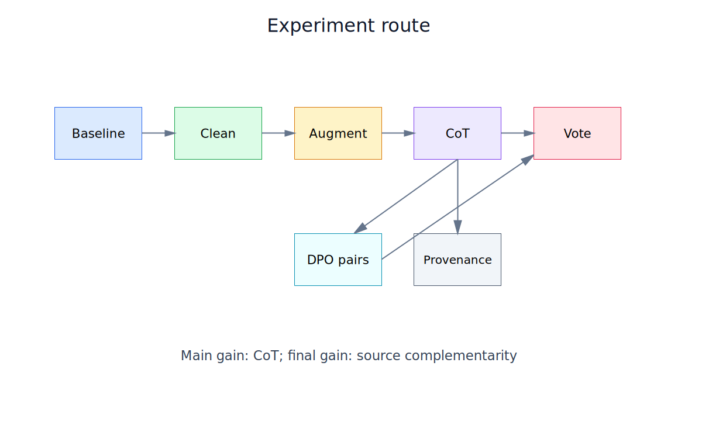
    <figcaption style="font-size:0.9em;"><b>图 0-1.</b> 实验路线。真正的大拐点来自 CoT，最后的收益来自不同 source 之间互补。</figcaption>
  </figure>
  <figure style="width:49%; margin:0;">
    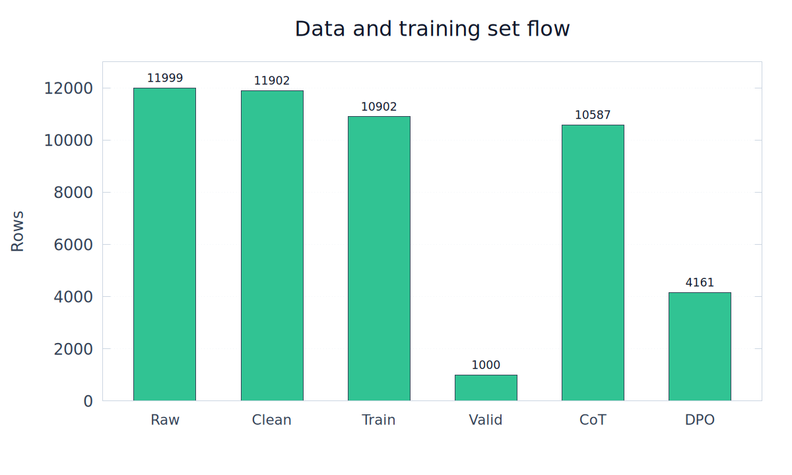
    <figcaption style="font-size:0.9em;"><b>图 0-2.</b> 数据流转。原始训练集 11999 条，清洗后进入 valid_v2 和后续 CoT、DPO 数据构建。</figcaption>
  </figure>
</div>

可以把整场 pre 的叙事压成一句话：我们先把“评估可信”这件事修好，再让模型学会写推理，最后用投票把不同模型会做的题拼起来。

## 1. 实验目的

实验目标不是单纯把一个 LoRA checkpoint 训出来，而是建立一套能迭代的数学题求解流程：

| 目标 | 为什么重要 | 最后怎么做 |
| --- | --- | --- |
| 答案抽取稳定 | 模型输出里可能有解释、单位、中间数字 | 用 `answer_utils.py` 统一抽取、规范化和比较答案 |
| 验证集可信 | 同一道题不能一边训练、一边验证 | 按清洗后的题面分组切分 `valid_v2` |
| 模型会做过程 | direct answer 很容易猜数 | 用 DeepSeek accepted CoT 训练模型输出推理和最终答案 |
| 多模型互补 | 不同 checkpoint 和不同训练数据错题不同 | 用多数投票合并 CoT、clean、DPO 多路 raw 输出 |
| 每轮可追溯 | 线上分数低时要能知道哪里错 | 保存 raw、wrong、wrong_analysis 和 vote provenance |

答案工具层是后续所有实验的底座。它做的事情很朴素：先找 `最终答案：` 后面的内容；如果没有这个标记，再从短输出里抽最后一个数值。这样 CoT 正文里的中间数字不会轻易被当成提交答案。

```python
_FINAL_MARKER_RE = re.compile(r"最终答案\s*[:：]")

def _extract_after_final_marker(text: str) -> ExtractionResult | None:
    matches = list(_FINAL_MARKER_RE.finditer(text))
    if not matches:
        return None
    marker = matches[-1]
    tail = text[marker.end() :].strip()
    result = _extract_from_text(tail, allow_unknown_short=True)
    if result is None:
        raise ValueError(f"最终答案标记后无法抽取答案：{tail[:80]}")
    return result
```

这段逻辑很关键。没有它，CoT 里“先算 12×3=36，最后答案 18”这种文本，很可能会把正文里的某个中间数抽走。

## 2. Step 1：Baseline 与本地分数失真

最早的 `base-001` 是一个原始 baseline：直接用 `train.json` 做 LoRA SFT，输出数字答案，不加额外清洗和复杂后处理。线上 DataFountain 分数是 `0.140125`。但它在旧本地验证集上有 `0.709`，这个差距太大，不能直接解释成“线上更难”，更像是本地验证集有问题。

后面审计发现，旧切分里 train 和 valid 有 36 个同题 overlap。也就是说，模型可能已经在训练里见过类似题面，本地分数自然会虚高。原始数据里还存在同题不同答案，例如同一道“450 千克大米，每天吃 60 千克，最多能吃几天？”同时有 `7` 和 `8` 两个答案。这类冲突如果不处理，会把模型往两个方向拉。

<div style="display:flex; gap:10px; align-items:flex-start;">
  <figure style="width:49%; margin:0;">
    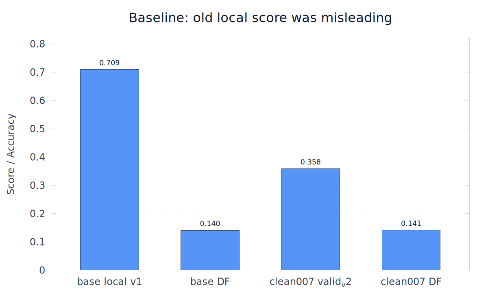
    <figcaption style="font-size:0.9em;"><b>图 1-1.</b> baseline 的旧本地分数很高，但 DF 很低。这个落差推动我们先检查验证集，而不是继续盲调参数。</figcaption>
  </figure>
  <figure style="width:49%; margin:0;">
    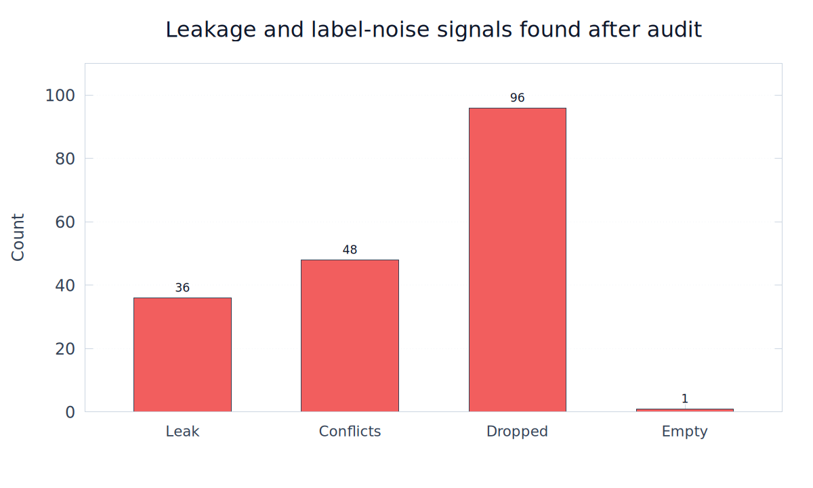
    <figcaption style="font-size:0.9em;"><b>图 1-2.</b> 数据审计发现 36 个 v1 同题 overlap，以及 48 组同题冲突答案。</figcaption>
  </figure>
</div>

<br/>
这一阶段的结论很明确：baseline 已经能跑通训练和提交，但不能相信旧验证分数。下一步必须先修数据和切分，否则后面所有本地提升都可能只是“背题”。

## 3. Step 2：数据清洗与 valid_v2

第二步先处理数据。清洗做了几件事：把题面里的列表拼成字符串，去掉空答案，统一答案格式，按清洗后的题面聚合样本，发现同题多答案时整组丢弃。这样做有点保守，但对于训练更安全，因为冲突标签会直接破坏监督信号。

清洗后再切分 `valid_v2`。这里不是随机按行切，而是按 `cleaned_question` 分组切：同一道题的不同版本必须一起进 train 或 valid。最终 `valid_v2` 的训练集是 10902 条，验证集是 1000 条，train/valid 同题 overlap 是 0。

<div style="display:flex; gap:10px; align-items:flex-start;">
  <figure style="width:49%; margin:0;">
    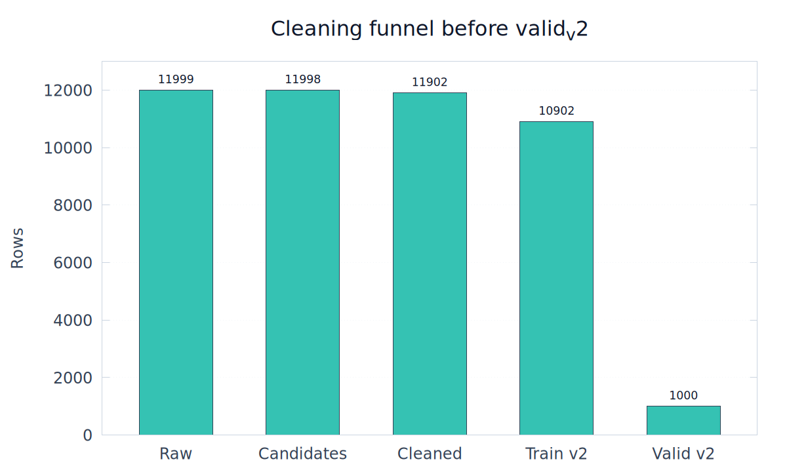
    <figcaption style="font-size:0.9em;"><b>图 2-1.</b> 清洗漏斗。11999 条原始样本经过空答案和冲突题处理后，形成 10902 条训练和 1000 条验证。</figcaption>
  </figure>
  <figure style="width:49%; margin:0;">
    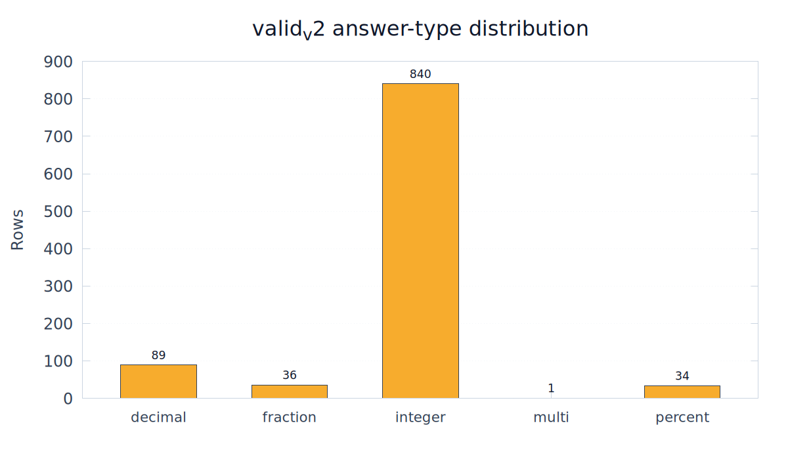
    <figcaption style="font-size:0.9em;"><b>图 2-2.</b> valid_v2 答案类型分布。整数题最多，但小数、分数、百分数正是容易出错的部分。</figcaption>
  </figure>
</div>

<br/>

对应代码在 `data_preprocess/prepare_data.py` 和 `data_preprocess/split.py`。关键点是“同题不跨 split”：

```python
def build_group_key(row: dict[str, Any]) -> str:
    question = row["question"]
    if not isinstance(question, str) or not question:
        raise ValueError("清洗后 question 必须是非空字符串")
    return question

def split_train_valid_by_group(rows, valid_size, seed):
    groups = group_rows_by_question(rows)
    valid_group_keys = _choose_valid_group_keys(groups, valid_size=valid_size, seed=seed)
    train_group_keys = set(groups) - valid_group_keys
    overlap_group_keys = train_group_keys & valid_group_keys
    if overlap_group_keys:
        raise ValueError(f"train/valid 存在同题泄漏：{sample}")
```

这一步以后，本地分数变低了，但它更可信。后续我们主要看 `valid_v2`，不再用旧验证集来判断模型好坏。

## 4. Step 3：Direct SFT 和 clean-007

在新验证集上重新看 direct SFT，模型表现没有旧验证集那么漂亮。`clean-007` 是 direct 路线里比较稳的版本，它相对前面版本主要把 `max_length` 从 384 提到 512，避免一部分训练样本的答案 token 被截断。结果是 valid_v2 `358/1000 = 0.358`，DataFountain `0.140875`。

这个结果说明 direct answer 模型不是完全没用，但上限很低。看错题会发现，大多数错误不是抽取失败，而是数值算错。也就是说，模型能输出一个像答案的数字，但它经常没有真的把关系算对。

<div style="display:flex; gap:10px; align-items:flex-start;">
  <figure style="width:49%; margin:0;">
    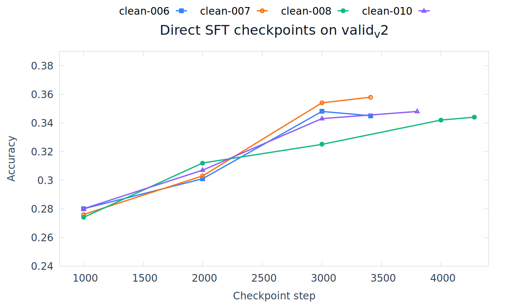
    <figcaption style="font-size:0.9em;"><b>图 3-1.</b> direct SFT 多个数据版本的 checkpoint 曲线。clean-007 最终 checkpoint 在 direct 路线里较稳。</figcaption>
  </figure>
  <figure style="width:49%; margin:0;">
    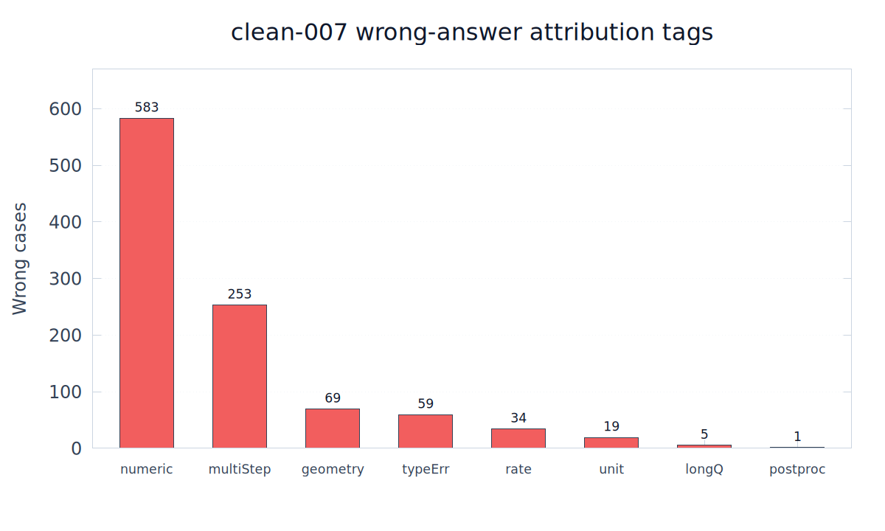
    <figcaption style="font-size:0.9em;"><b>图 3-2.</b> clean-007 错题归因。数值错误最多，多步题、几何题和单位换算也很突出。</figcaption>
  </figure>
</div>

<br/>

训练入口的关键约束是：截断以后仍然要保留答案 token，否则样本就没有监督信号。

```python
if len(input_ids) > max_length:
    input_ids = input_ids[:max_length]
    attention_mask = attention_mask[:max_length]
    labels = labels[:max_length]

if not any(label != -100 for label in labels):
    sample_id = example["id"]
    raise ValueError(f"样本 {sample_id} 在 max_length={max_length} 下没有答案 token")
```

这一阶段的结论是：direct SFT 可以作为底座，但不能指望它自己学会稳定推理。下一步先针对薄弱题型补数据，看能不能把 direct 模型再推一点。

## 5. Step 4：clean-008 / clean-010 数据增强

clean-008 和 clean-010 都是从 `train_sft_v2.json` 派生出来的增强数据。clean-008 关注弱答案类型、比例速度、单位换算，新增 2794 条；clean-010 只复制几何标签样本，新增 1248 条。

这里的增强方式很克制：不是随便生成新题，而是对已有训练样本做确定性复制。每个源样本最多复制一次，并保留 `source_id`、`augment_policy`、`augment_reason`，方便回溯。这样风险比自动生成新题低，也不会让 valid_v2 泄漏进训练集。

<div style="display:flex; gap:10px; align-items:flex-start;">
  <figure style="width:49%; margin:0;">
    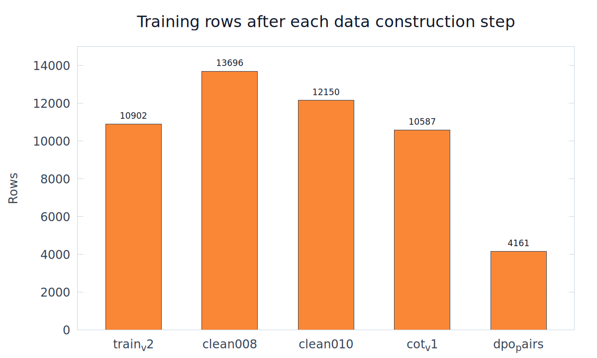
    <figcaption style="font-size:0.9em;"><b>图 4-1.</b> 各阶段训练数据规模。clean-008 增强最多，DPO pairs 最少但更有针对性。</figcaption>
  </figure>
  <figure style="width:49%; margin:0;">
    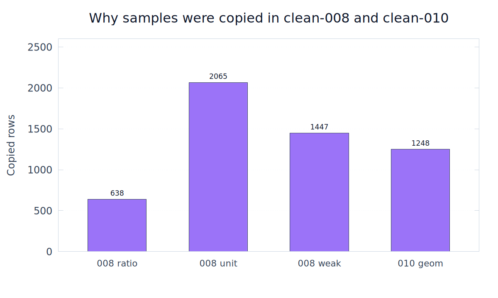
    <figcaption style="font-size:0.9em;"><b>图 4-2.</b> 增强原因分布。clean-008 主要补 unit_scale_focus 和 weak_answer_type，clean-010 只补 geometry_focus。</figcaption>
  </figure>
</div>

<br/>

增强策略在代码里是 registry 形式，不把所有规则堆在主流程里：

```python
def _build_clean008_reasons(feature_tags: list[str]) -> list[str]:
    feature_tag_set = set(feature_tags)
    reason_flags = {
        "weak_answer_type": "weak_answer_type" in feature_tag_set,
        "rate_ratio": "rate_ratio" in feature_tag_set,
        "unit_scale_focus": "unit_scale" in feature_tag_set
        and any(tag in feature_tag_set for tag in UNIT_SCALE_FOCUS_TAGS),
    }
    return [reason for reason in CLEAN008_REASON_ORDER if reason_flags[reason]]

def _build_clean010_reasons(feature_tags: list[str]) -> list[str]:
    if "geometry" in set(feature_tags):
        return ["geometry_focus"]
    return []
```

增强后的单模型没有明显超过 clean-007：clean-008 是 0.344，clean-010 是 0.348。这个结果说明，单靠复制样本不能解决数学推理问题。但它们会在少数题上给出和 clean-007 不同的答案，所以可以进入后面的组合和投票。

## 6. Step 5：三源组合

三源组合是第一次在推理阶段合并多个模型。我没有让模型互相讨论，只是按题面关键词做一个简单 selector：如果是多步题，选 clean-010；如果有单位换算标签，选 clean-008；其他题选 clean-007。

本地结果从 clean-007 的 0.358 提到 0.374，说明确实有互补。但线上 DF 从 0.140875 小降到 0.140750，说明这个 selector 太粗，线上题型分布和 valid_v2 不完全一致时，规则路由会把一些本来答对的题换错。

<div style="display:flex; gap:10px; align-items:flex-start;">
  <figure style="width:49%; margin:0;">
    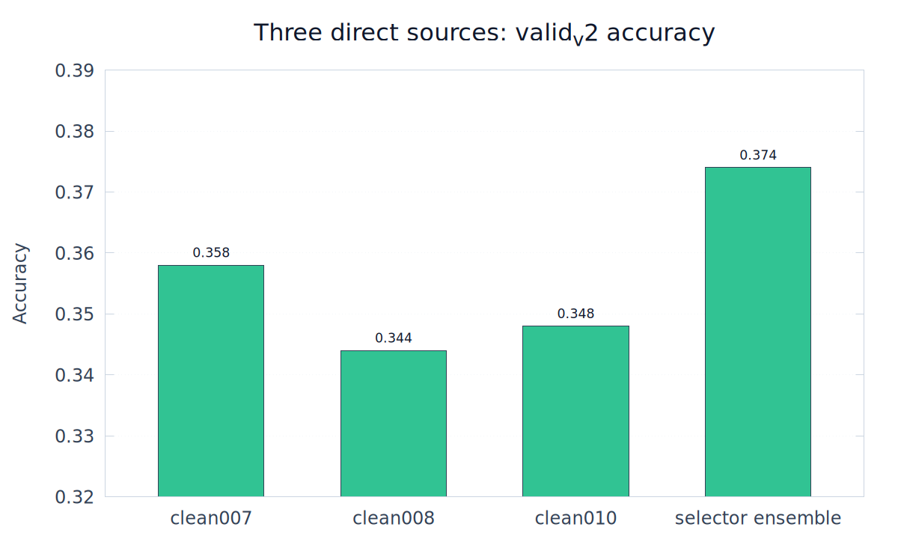
    <figcaption style="font-size:0.9em;"><b>图 5-1.</b> 三源组合在 valid_v2 上比任一 direct 单模型高，但提升幅度有限。</figcaption>
  </figure>
  <figure style="width:49%; margin:0;">
    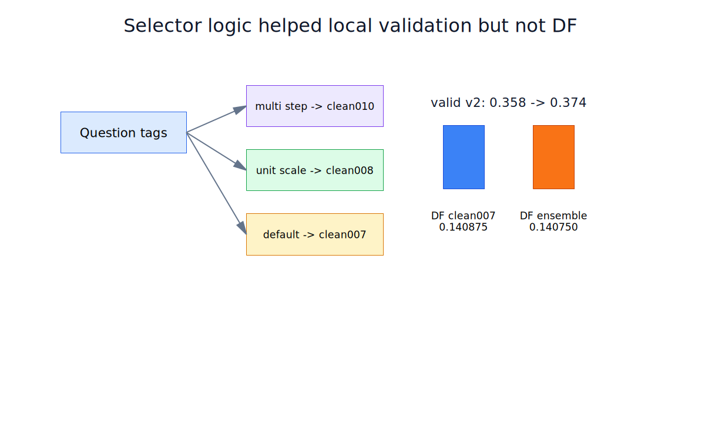
    <figcaption style="font-size:0.9em;"><b>图 5-2.</b> selector 规则。它让本地结果上涨，但线上略降，说明手写路由不够稳。</figcaption>
  </figure>
</div>

<br/>

对应代码很短，也能看出它为什么容易粗糙：

```python
def select_source(question_tags: list[str]) -> str:
    if TAG_MULTI_STEP in question_tags:
        return SOURCE_CLEAN010
    if TAG_UNIT_SCALE in question_tags:
        return SOURCE_CLEAN008
    return SOURCE_CLEAN007
```

这一步给了一个很有用的信号：多模型确实有互补，但不能只靠手写 selector。后面我们改成 majority vote，让答案自己投票，而不是让题面规则硬选一个 source。

## 7. Step 6：CoT SFT 单模型

CoT 是整个实验最大的拐点。direct 模型像是在“猜最后一个数”，而 CoT 会先写简短推理，再单独输出 `最终答案：<答案>`。训练数据来自 DeepSeek 生成并筛选后的 accepted CoT，最终输出 `train_sft_cot_v1.json` 有 10587 条。

结果变化很明显：`cot-001` 单模型 valid_v2 到 `544/1000 = 0.544`，DataFountain 到 `0.228375`。相对 clean-007，valid_v2 提升 18.6 个百分点，DF 提升 0.0875。这个提升不是因为输出更长，而是因为模型被迫把条件关系写出来，再收束到最终答案。

<div style="display:flex; gap:10px; align-items:flex-start;">
  <figure style="width:49%; margin:0;">
    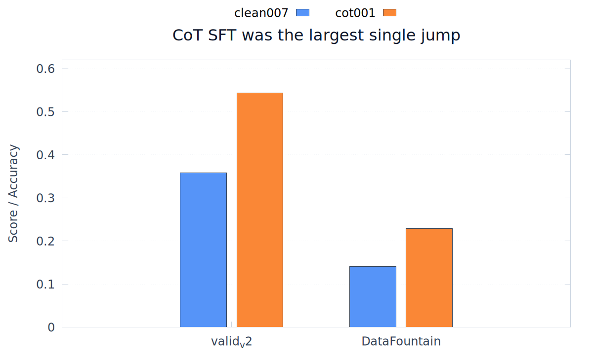
    <figcaption style="font-size:0.9em;"><b>图 6-1.</b> CoT 带来最大单次提升。valid_v2 和 DF 都明显高于 direct clean-007。</figcaption>
  </figure>
  <figure style="width:49%; margin:0;">
    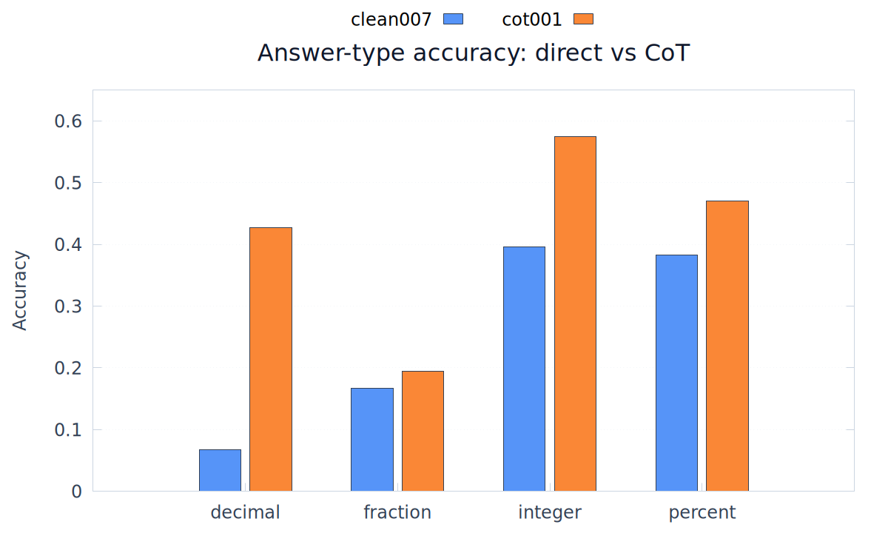
    <figcaption style="font-size:0.9em;"><b>图 6-2.</b> 按答案类型看，CoT 对小数、整数、百分数都有明显帮助，分数题仍然偏弱。</figcaption>
  </figure>
</div>

prompt profile 里把 direct 和 CoT 分开，CoT 的训练目标不再是 `answer`，而是 `cot_response`：

```python
DIRECT_INSTRUCTION = "这是小学数学1-6年级的校内题目，无需进行分析，请直接输出数字答案，不带单位。"
COT_INSTRUCTION = "这是小学数学1-6年级的校内题目，请先给出简短推理过程，最后单独输出“最终答案：<答案>”。最终答案不带单位。"

_PROFILES = {
    "direct": PromptProfile(name="direct", target_field="answer", default_max_new_tokens=32),
    "cot": PromptProfile(name="cot", target_field="cot_response", answer_marker="最终答案：", default_max_new_tokens=128),
}
```

不过 CoT 也不是万能的。比如几何题里，模型会写出看起来合理的过程，但把“横截一次增加几个面”理解错。它从猜数变成了会写过程，但过程本身仍可能错。所以下一步要看多个 CoT checkpoint 是否能互相补。

## 8. Step 7：CoT 多 checkpoint 投票

`cot-001` 训练过程中保存了多个 checkpoint。checkpoint-2000 单模型最好，但其他 checkpoint 会在少数题上给出不同且正确的答案。于是我们把 checkpoint-2000、3310、3000、1000 四路 raw 结果做 majority vote，平票时按 source 顺序回退。

投票后 valid_v2 从 0.544 提到 0.577，DF 从 0.228375 提到 0.244375。这个提升比较扎实，因为投票不是改模型，而是利用多个 checkpoint 的错误不完全重合。

<div style="display:flex; gap:10px; align-items:flex-start;">
  <figure style="width:49%; margin:0;">
    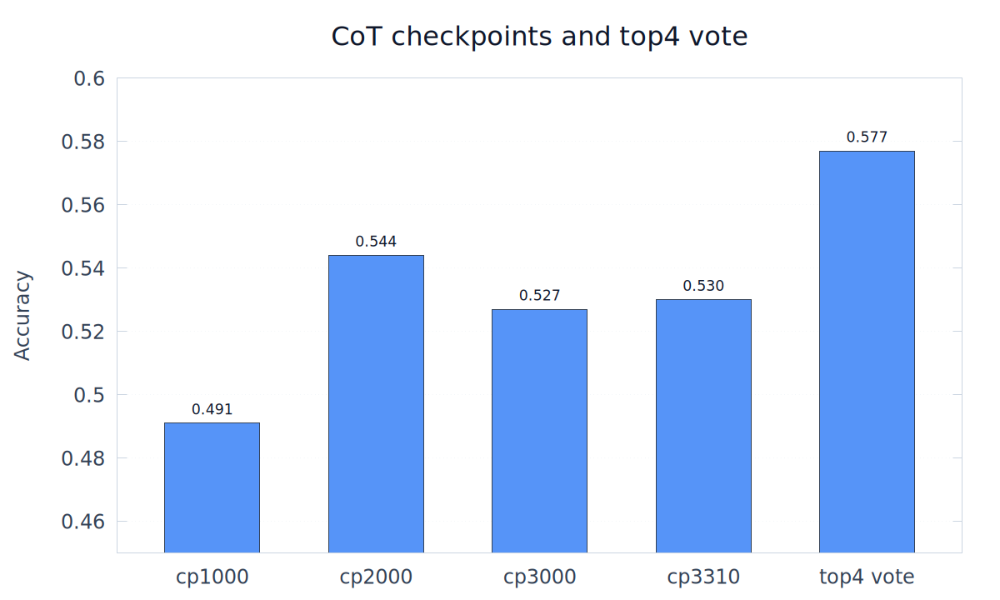
    <figcaption style="font-size:0.9em;"><b>图 7-1.</b> CoT 多 checkpoint 与 top4 投票。单个 checkpoint 有波动，投票高于任一单源。</figcaption>
  </figure>
  <figure style="width:49%; margin:0;">
    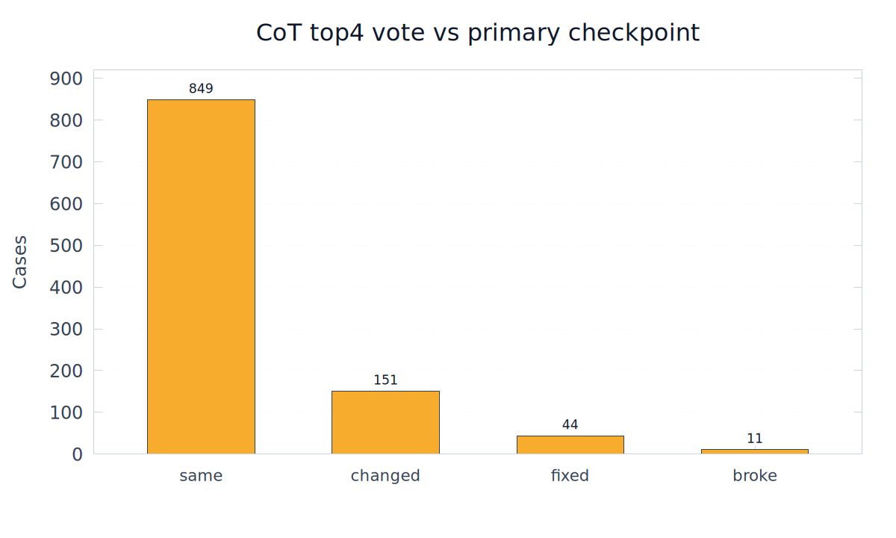
    <figcaption style="font-size:0.9em;"><b>图 7-2.</b> CoT top4 投票相对 primary checkpoint 改动 151 题，改对 44 题，也改错 11 题。</figcaption>
  </figure>
</div>

<br/>

投票逻辑没有用复杂模型，只做规范化后的多数票：

```python
vote_counts = dict(Counter(str(candidate.normalized_answer) for candidate in participating))
max_count = max(vote_counts.values())
tied_answers = {
    answer
    for answer, count in vote_counts.items()
    if count == max_count
}
selected_source, selected_answer = ranked_tie_break(
    tied_answers=tied_answers,
    candidates=candidates,
    source_order=source_order,
)
```

这里的关键是先做 `normalize_answer`，再投票。否则 `1/2`、`1 / 2`、`1／2` 之类格式会被当成不同答案。CoT 投票成功以后，我们继续把前面那些 direct clean 模型也放进来，看弱模型能不能补洞。

## 9. Step 8：异质投票

异质投票把 CoT top4 和 clean-007/008/010 三个 direct 模型合在一起，形成七源投票。虽然 clean 模型单独看只有 0.34 到 0.36，但它们和 CoT 错法不同。某些单位换算、分数、简单计算题上，direct 模型反而可能给出正确答案。

七源投票的 valid_v2 达到 0.612，DF 达到 0.252125，这是本地最高的一组。这个结果说明，“弱模型”不一定没价值。只要错误分布和主模型不同，它就能在投票里补少数洞。

<div style="display:flex; gap:10px; align-items:flex-start;">
  <figure style="width:49%; margin:0;">
    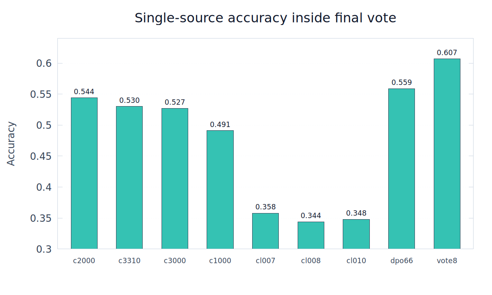
    <figcaption style="font-size:0.9em;"><b>图 8-1.</b> 最终八源投票里的单源准确率。clean 源单独较弱，但提供了不同答案来源。</figcaption>
  </figure>
  <figure style="width:49%; margin:0;">
    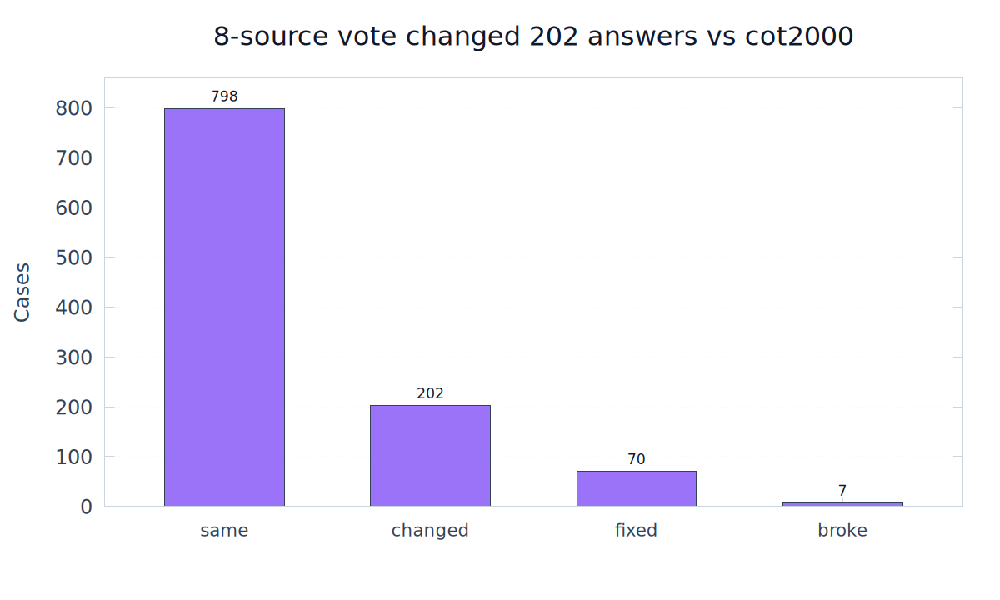
    <figcaption style="font-size:0.9em;"><b>图 8-2.</b> 八源投票相对 cot2000 改动 202 题，其中改对 70 题，改错 7 题。</figcaption>
  </figure>
</div>

<br/>

投票 raw 里每题都会保存候选答案、规范化答案、票数和被选 source。例如一题可能有 `cot2000=4/3`，clean 源都给 `4/9`，最后多数票会把答案拉回 `4/9`。这种 provenance 对复盘很有用，因为我们能看到每个答案从哪一路来。

这一阶段也暴露了一个问题：平票仍然按 source 顺序回退。也就是说，当所有模型都不一致时，我们还是默认相信前面的 CoT checkpoint。这个策略简单可靠，但还不够聪明。

## 10. Step 9：DPO 与最终八源

DPO 的思路是：既然 CoT 已经让模型会写过程，就再让模型偏向“更像正确推理”的输出。我们用 accepted CoT 作为 chosen，再用 cot-001 在训练集上的真实错误生成作为 rejected。这样负样本不是随便编的，而是当前模型真的会犯的错。

最终从 10587 条 CoT 训练样本里筛出 4161 对 DPO pairs。DPO 单模型 valid_v2 是 0.559，比 cot-001 单模型 0.544 高；DF 是 0.230250，也比 cot-001 的 0.228375 略高。但把 DPO 加入八源投票后，valid_v2 从七源 0.612 降到 0.607，线上 DF 从 0.252125 小涨到 0.252375。

<div style="display:flex; gap:10px; align-items:flex-start;">
  <figure style="width:49%; margin:0;">
    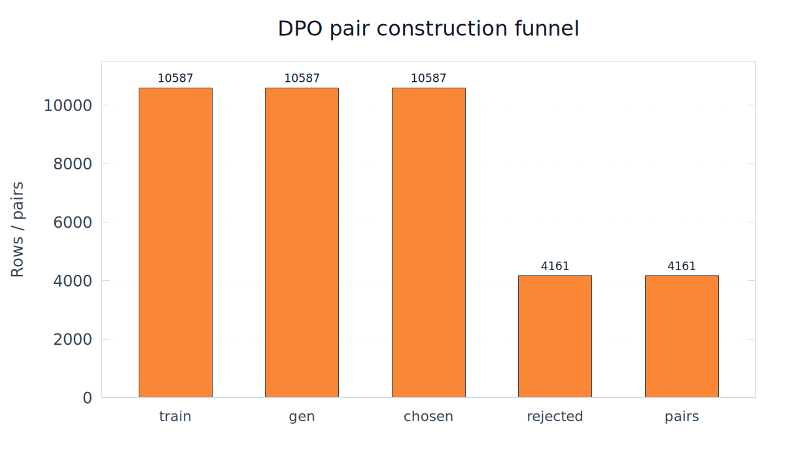
    <figcaption style="font-size:0.9em;"><b>图 9-1.</b> DPO 数据构造漏斗。只有答案错误且抽取状态正常的生成，才会作为 rejected。</figcaption>
  </figure>
  <figure style="width:49%; margin:0;">
    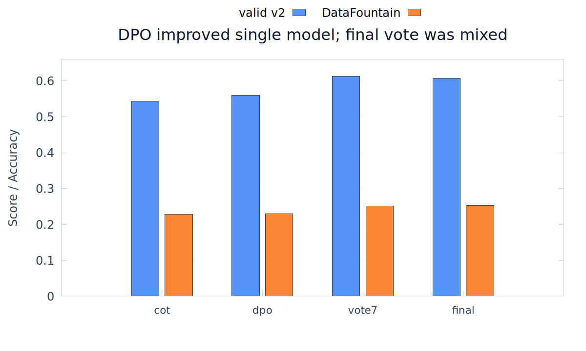
    <figcaption style="font-size:0.9em;"><b>图 9-2.</b> DPO 单模型有收益，但加入投票后本地不升反降，线上只小幅上涨。</figcaption>
  </figure>
</div>

<br/>

DPO pair 构造里有两个保护：chosen 必须能抽出正确最终答案，rejected 必须确认是错误答案。

```python
def validate_chosen_response(row: dict[str, Any]) -> str:
    chosen = require_text(row, "cot_response", row_id)
    if "最终答案：" not in chosen:
        raise ValueError(f"样本 {row_id} chosen 缺少最终答案标记")
    extracted = extract_final_answer(chosen)
    if not compare_answers(extracted.answer, gold_answer):
        raise ValueError(f"样本 {row_id} chosen 最终答案与 gold 不一致")
    return chosen

def validate_rejected_response(row: dict[str, Any]) -> str | None:
    if correct is not False or extract_status != "matched":
        return None
    extracted = extract_final_answer(raw_response)
    if compare_answers(extracted.answer, gold_answer):
        raise ValueError("generated 标记为错误但抽取答案与 gold 一致")
    return raw_response
```

DPO 训练本身从 cot-001 checkpoint-2000 启动，同时加载一个冻结 reference model：

```python
policy_model = load_policy_model(args.base_model, args.policy_checkpoint, args.gradient_checkpointing)
reference_model = load_reference_model(args.base_model, args.policy_checkpoint)

trainer = DPOTrainer(
    model=policy_model,
    ref_model=reference_model,
    args=training_args,
    train_dataset=train_dataset,
    processing_class=tokenizer,
)
```

这轮的结论比较微妙：DPO 确实改变了模型，单模型也有小收益，但 rejected 数据还不够细。它可能把“答案错但表达像对的”“格式错”“中间计算错”混在一起学，导致加入投票后没有稳定增强。

## 11. 最终结果总结

从所有实验看，提升不是均匀发生的，而是几个关键点叠出来的：

| 阶段 | valid_v2 | DataFountain | 主要结论 |
| --- | ---: | ---: | --- |
| base-001 | 旧 valid 0.709 | 0.140125 | 本地分数失真，不能作为后续判断依据 |
| clean-007 | 0.358 | 0.140875 | direct SFT 能跑稳，但推理能力不够 |
| clean 三源组合 | 0.374 | 0.140750 | 本地有补位，线上不稳 |
| cot-001 | 0.544 | 0.228375 | CoT 是最大拐点 |
| cot-001-vote-top4 | 0.577 | 0.244375 | 多 checkpoint 投票有效 |
| cot4-clean007008010-vote | 0.612 | 0.252125 | 七源异质投票本地最高 |
| dpo-cot001-best | 0.559 | 0.230250 | DPO 单模型略有收益 |
| cot4-clean007008010-dpo66-vote | 0.607 | 0.252375 | 最终线上最高 |

<div style="display:flex; gap:10px; align-items:flex-start;">
  <figure style="width:49%; margin:0;">
    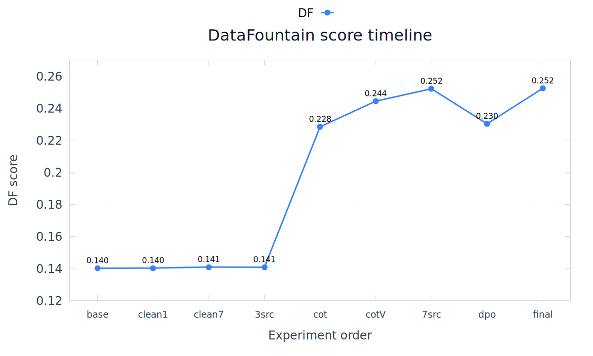
    <figcaption style="font-size:0.9em;"><b>图 10-1.</b> DataFountain 分数时间线。CoT 之后分数进入第二个区间，投票继续往上补。</figcaption>
  </figure>
  <figure style="width:49%; margin:0;">
    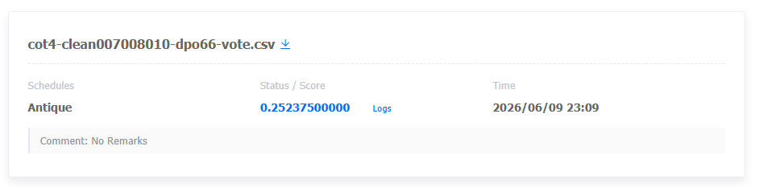
    <figcaption style="font-size:0.9em;"><b>图 10-2.</b> 最终提交截图。最终分数为 0.252375。</figcaption>
  </figure>
</div>

<br/>
最后可以这样总结：数据清洗没有让线上分数马上暴涨，但它把验证集变可信了；CoT 真正拉高模型上限；投票利用不同 checkpoint 和不同数据版本的互补性继续补题；DPO 单独有效，但偏好数据还没有细到能稳定增强最终投票。

## 12. 后续改进方案

第一，继续按错题类型补 CoT。现在 wrong_analysis 已经能标出 `geometry_keyword`、`unit_scale_suspect`、`numeric_value_error`、`multi_step_keyword` 等标签，后面可以对每类错题单独生成更高质量的 CoT，而不是笼统补一批数据。

第二，把投票从“多数票 + 固定平票回退”升级成按题型加权。比如几何题可以提高 clean-010 或几何专门模型权重，分数题提高 CoT 中分数表现较好的 checkpoint 权重，平票时不再固定按 source 顺序。

第三，重做 DPO rejected。现在 rejected 只保证答案错，但没有区分错因。后面可以拆成三类：答案格式错、计算过程错、推理方向错。这样 DPO 学到的是更清楚的偏好，而不是把所有错误混成一个负样本。

第四，把评估结果自动回流。每轮评估后，把高置信错题、投票分歧题、后处理失败题打包成下一轮数据构建输入。这样实验就从手工看错题，变成更稳定的数据迭代流程。

## 13. 尾声


这次实验最重要的经验不是某个参数，而是先把实验闭环做出来。baseline 让我们发现旧验证集不可信，valid_v2 让后面的分数有了参照，CoT 让模型从猜答案变成写过程，投票把不同模型的少数优势拼起来。最终线上分数从 0.140125 到 0.252375，主要提升来自 CoT 和投票。后续如果继续做，重点不应该是盲目再训，而是把错题分析、题型加权投票和更细的 DPO 数据接起来。
