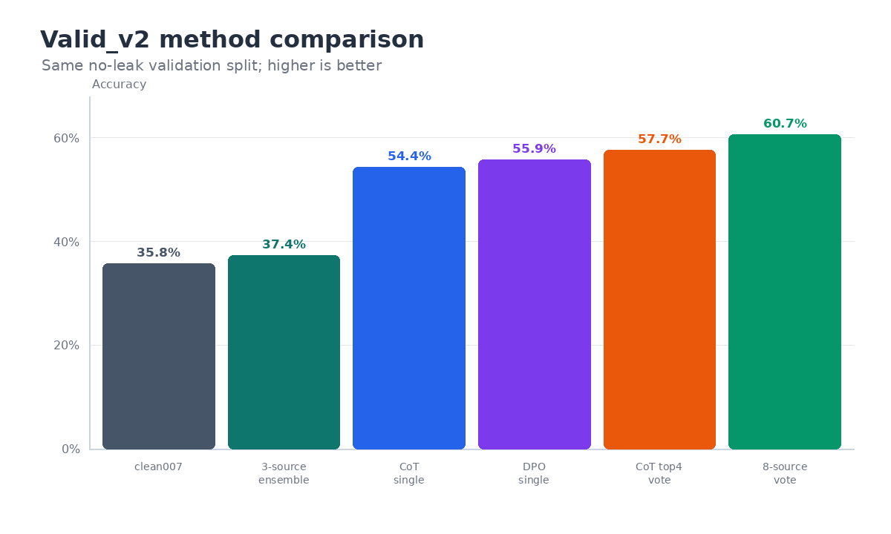
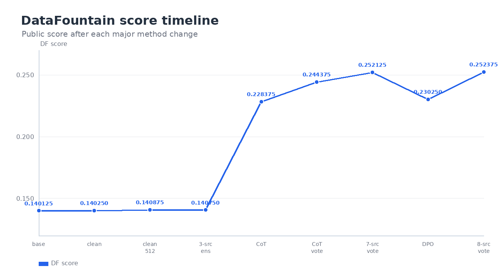
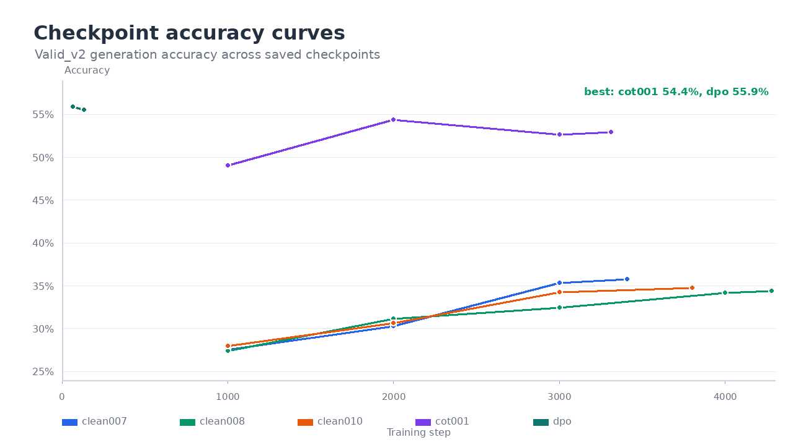
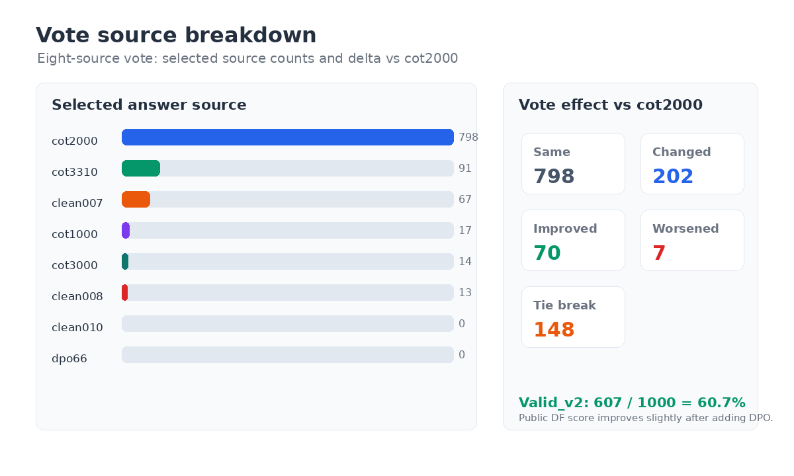

# 小学数学题求解实验报告

> 模型：Qwen2.5-0.5B-Instruct；主要训练方式：LoRA SFT；最终提交：`cot4-clean007008010-dpo66-vote.csv`。
>**郑智君 23307130062**

## 一、实验目的

本实验的任务是让一个 0.5B 规模的开源模型解小学数学题，并输出可以提交到 DataFountain 的最终答案。题目看起来短，但坑不少：分数、小数、百分数、单位换算、几何、多步应用题都会影响答案抽取。

所以实验目标不是只把训练跑通，而是做一个完整闭环：先把数据洗干净，再让模型学会“算过程”，最后用多个模型结果互相补位。整个过程中重点保证训练集和验证集不泄漏，避免本地分数虚高。

## 二、实验方法

| 方法 | 具体做法 | 作用 |
| --- | --- | --- |
| 数据构建 | 清洗题面和答案，按清洗后的题面分组切分 `valid_v2`；训练 10902 条，验证 1000 条，同题 overlap 为 0 | 让验证分数更可信 |
| 数据增强 | `clean-008` 复制弱答案类型、比例速度、单位换算题；`clean-010` 重点复制几何题 | 补模型薄弱题型 |
| CoT | 用 DeepSeek 生成可接受的推理过程，训练模型输出“推理 + 最终答案” | 让模型少直接猜，多做中间计算 |
| DPO | accepted CoT 作为 chosen，cot-001 错误生成作为 rejected，共构造 4161 对偏好样本 | 让模型偏向更稳的解题表达 |
| 模型投票 | CoT 多 checkpoint 投票，再加入 clean 系列和 DPO 结果做八源投票 | 利用不同模型的互补性 |

核心思路其实比较朴素：先把“答案到底是什么”这件事做准，再谈训练。小学数学题里经常出现 `1/2`、`50%`、`0.5` 这类等价但格式不同的答案，所以代码里先用 `answer_utils` 统一抽取、规范化和比较答案。验证集也不是随机切，而是按清洗后的题面分组切分；这样同一道题的改写不会一边进训练、一边进验证，本地分数才不容易自我安慰。

CoT 的设计也尽量克制。模型可以写推理，但最后必须单独写 `最终答案：<答案>`，推理正文里的中间数字不参与提交答案抽取。DPO 则接在 CoT 后面做：accepted CoT 当作 chosen，模型自己在训练集上生成错的回答当作 rejected。这样 preference pair 更贴近当前模型真的会犯的错，而不是随便拼一个负样本。投票阶段也没有对文本做平均，而是先把每一路 raw 结果里的答案规范化，再按 majority vote 选答案；平票时才按 source 顺序回退。

实现上还刻意把训练、推理、评估拆开。训练脚本只负责产出 checkpoint，不直接相信 `eval_loss`；推理脚本保存每题原始输出；评估脚本再根据生成答案算准确率、保存错题和归因。这样每次提交前都能追到“这个答案从哪个模型来、为什么被选中”，后面做投票和 DPO 时也省了很多返工。

  <figure style="width:49%; margin:0;">
    
    <figcaption style="font-size:0.9em;"><b>图 1.</b> valid_v2 上的主要方法对比。CoT 是最大拐点，投票继续补上不少题。</figcaption>
  </figure>
  <figure style="width:49%; margin:0;">
    
    <figcaption style="font-size:0.9em;"><b>图 2.</b> DataFountain 分数走势。最终八源投票达到 0.252375。</figcaption>
  </figure>

## 三、实验过程

整个实验不是一次性把参数调出来的，而是一个很典型的循环：先跑一个能提交的版本，发现分数和错题问题，再补工具链；之后每轮都看 valid_v2、raw 输出和 wrong 分析，再决定下一步是改数据、改 prompt，还是做组合。这样虽然慢一点，但每次改动都有原因，不至于只靠碰运气。

| 阶段 | 为什么改 | 做了什么 | 结果和下一步 |
| --- | --- | --- | --- |
| baseline | 先建立可跑通的起点 | 用原始数据做 LoRA SFT，直接生成答案 | DF `0.140125`。能跑通，但模型容易格式乱、直接猜。下一步先修工具链和数据 |
| 数据清洗 | 原始数据有噪声，旧验证集也可能不够可靠 | 做答案规范化、题面清洗、冲突样本剔除；`answer_utils` 负责抽取和比较答案 | `clean-001-final` DF 到 `0.140250`，提升很小。说明只清洗还不够 |
| valid_v2 | 需要一个更可信的本地验证集 | 按清洗题面分组切分；`evaluation` 保存 metrics、raw、wrong 和 wrong_analysis | train/valid overlap 为 0。后续本地结果统一看 valid_v2 |
| clean-007 | 直接答案模型可能被截断 | 把 max_length 从 384 提到 512 | valid_v2 `358/1000`，DF `0.140875`。比清洗版稳一点，但上限仍低 |
| clean-008/010 | 小数、分数、单位、几何题明显偏弱 | clean-008 新增 2794 条增强样本；clean-010 新增 1248 条几何样本 | 单模型没有明显超过 clean-007，但给后面的异质投票提供了不同答案来源 |
| 三源组合 | 不同增强数据会错在不同题上 | 用 clean-007/008/010 的 raw 结果做题面 selector 组合 | valid_v2 `374/1000`，本地有提升；DF `0.140750` 略降，说明简单路由还不够稳 |
| CoT SFT | 直接给答案太像“猜数”，数学题需要中间过程 | 用 DeepSeek 生成 accepted CoT，训练 `cot-001`，答案从“最终答案：”后抽取 | valid_v2 `544/1000`，DF `0.228375`。这是最大提升，下一步尝试多 checkpoint 互补 |
| CoT 投票 | 单 checkpoint 有波动，多个 checkpoint 会犯不同错 | `ensemble/voting` 读取四路 raw，先规范化答案，再 majority vote | valid_v2 `577/1000`，DF `0.244375`。比单模型多对 33 题 |
| 异质投票 | clean 模型虽然弱，但可能在少数题上给出不同正确答案 | CoT top4 + clean-007/008/010 七源投票，保留 source provenance | valid_v2 `612/1000`，DF `0.252125`。说明“弱模型”也能补洞 |
| DPO | 希望模型更偏向正确推理，而不是只靠投票 | accepted CoT 做 chosen，cot-001 训练集错误生成做 rejected，训练 2 epochs | DPO 单模型 valid_v2 `559/1000`，DF `0.230250`。加入八源投票后 DF 到 `0.252375`，但 valid_v2 从 0.612 降到 0.607，泛化还不够稳 |

  <figure style="width:49%; margin:0;">
    
    <figcaption style="font-size:0.9em;"><b>图 3.</b> 多个 checkpoint 的验证准确率。CoT 与 DPO 明显高于 direct clean 模型。</figcaption>
  </figure>
  <figure style="width:49%; margin:0;">
    
    <figcaption style="font-size:0.9em;"><b>图 4.</b> 八源投票拆解。多数题仍跟 cot2000 一致；投票改对 70 题，也改错 7 题。</figcaption>
  </figure>

## 四、实验结果

这里把两类结果分开看：DataFountain 是最终提交分数；valid_v2 是本地无泄漏验证集。`base-001` 的本地指标来自旧 `valid_sft_v1`，不和 valid_v2 直接横向比较。

| 实验 | valid_v2 | DataFountain | 说明 |
| --- | ---: | ---: | --- |
| clean-007 | 0.358 | 0.140875 | direct SFT 中较好的单模型 |
| clean 三源组合 | 0.374 | 0.140750 | 本地提升，线上略降 |
| cot-001 | 0.544 | 0.228375 | CoT 带来主要提升 |
| cot-001-vote-top4 | 0.577 | 0.244375 | 多 checkpoint 投票有效 |
| cot4-clean007008010-vote | 0.612 | 0.252125 | 七源异质投票，本地最高 |
| dpo-cot001-best | 0.559 | 0.230250 | DPO 单模型略高于 CoT 单模型 |
| cot4-clean007008010-dpo66-vote | 0.607 | **0.252375** | 最终提交，线上最高 |

从结果看，clean 系列主要是在“流程稳定”和“提供异质答案”上有价值，单独靠 direct SFT 很难突破。真正的拐点是 CoT：它不是简单让输出变长，而是逼模型先把条件关系写出来，最后再收束到一个答案。DPO 的情况更微妙，单模型比 cot-001 好，但放进投票后 valid_v2 反而从 0.612 降到 0.607；这说明偏好学习确实改了模型习惯，但 rejected 样本还不够细，可能把一部分本来正确的解题风格也扰动了。

<figure style="margin:8px 0 0 0;">
  
  <figcaption style="text-align:center; font-size:0.9em;"><b>图 5.</b> 最终 DataFountain 提交结果截图，最终分数为 0.252375。</figcaption>
</figure>

最终结果可以概括成一句话：数据清洗让流程稳定，CoT 真正拉高上限，投票把不同 checkpoint 和不同数据版本的优势拼起来。DPO 有单模型收益，但加入投票后本地没有继续涨，说明偏好数据还需要更细地筛。

## 五、实验展望

后续最值得做的不是盲目再训练，而是把错题用起来。

1. 继续按错题类型补 CoT。现在已经有 `wrong_analysis.json(l)`，可以统计分数、比例、几何、单位换算分别错在哪里，再针对性生成新的 CoT 数据。
2. 改进投票策略。当前平票主要按 source 顺序回退，比较粗。后面可以按题型选择可信模型，比如几何题更信 clean-010 或专门几何模型，分数题更信 CoT。
3. 重做 DPO 的 rejected。现在 rejected 主要来自 cot-001 的错误生成，质量不均匀。可以把“答案错但过程像对的”“答案格式错”“中间计算错”分开构造，减少 DPO 学偏。
4. 增加自动回流。评估后自动把高置信错题、投票分歧题、后处理失败题打包成下一轮数据构建输入，让实验从手动调参变成稳定迭代。
